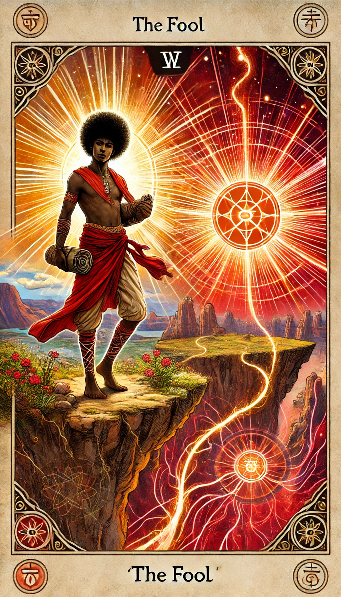

# Create an updated README.md with preview gallery for the user's repo

readme_content = """# The Healing Vibes Empress Tarot Deck

This repository hosts a complete digital tarot deck organized into **Major Arcana** and the four suits: **Wands, Cups, Swords, Pentacles**.

---

## 📂 Repository Structure
- Individual `.png` card files (uploaded one by one)
- Suit bundles in separate ZIPs:
  - `Major_Arcana.zip`
  - `Wands.zip`
  - `Cups.zip`
  - `Swords.zip`
  - `Pentacles.zip`
- `manifest.csv` (reference sheet mapping filenames → card names, categories, and suits)

---

## 🃏 What’s Included
- **79 tarot card images** (Major + Minor Arcana).
- **Clean naming** so cards are easy to identify:
  - Example: `00_Fool.png`, `12_Swords_Knight.png`
- **Manifest file** for quick lookup.

---

## 🖼️ Card Preview

| Fool | Magician | High Priestess |
|------|----------|----------------|
|  |  |  |

| Empress | Emperor | Hierophant |
|---------|---------|------------|
|  |  |  |

*(Explore the repo to view all cards or download suit ZIPs.)*

---

## 🔮 How to Use
- **Browse cards** on GitHub or download ZIPs per suit.  
- Use `manifest.csv` as a guide for renaming, study, or app integration.  
- Ideal for:
  - Tarot readings
  - Study & practice
  - Digital/creative projects
"""

readme_path = Path("/mnt/data/README.md")
with open(readme_path, "w", encoding="utf-8") as f:
    f.write(readme_content)

readme_path
